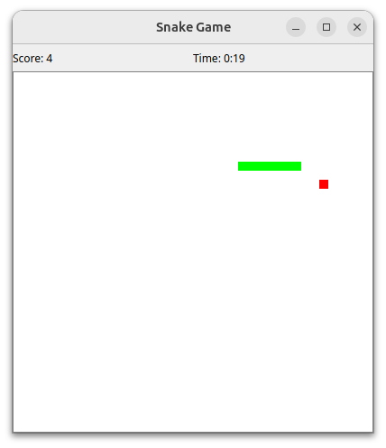
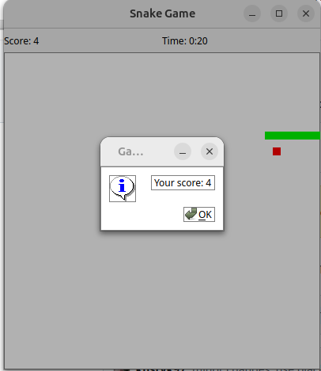

# PySnake
Snake game written in Python with PyQt


## Installation
1. Clone the repository:
 ```bash
    git clone https://github.com/kustyk97/PySnake.git
 ```
2. Navigate to the project directory:
 ```bash
    cd PySnale
 ```
3. Install the required packages:
 ```bash
    pip install -r requirements.txt
 ```

## Running program (Usage)

```bash
python main.py
```

### Example screenshot
|  |  |
|-----------------------------------|----------------------------------|
